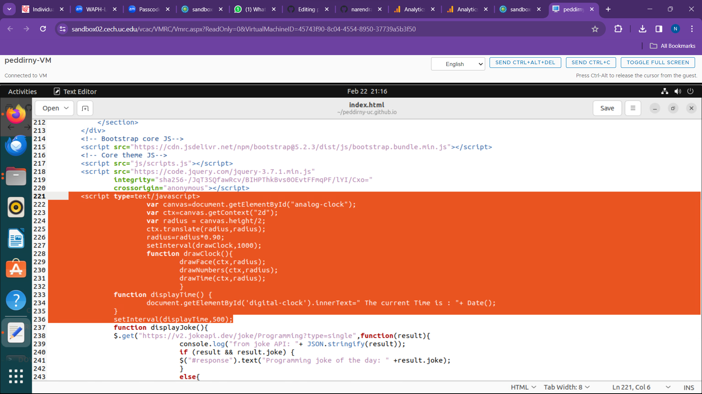

# peddirny-uc.github.io
# WAPH: WEB APPLICATION PROGRAMMING AND HACKING
# waph-peddinry
## instructor : Dr.Phu Phung
**Name**: Narendra Reddy Peddireddy
**Email**: peddirny@mail.uc.edu

Repository's URL: [https://github.com/narendra2105/waph-peddinry.git](https://github.com/narendra2105/waph-peddinry.git)

Individual project Repository's URL: [https://github.com/narendra2105/peddirny-uc.github.io](https://github.com/narendra2105/peddirny-uc.github.io)

Narendra Reddy Peddireddy uses this private repository to house all of the course's code. The following is how this repository is organized.

### Individual_Project_1

### Overview of Individual_Project_1

The goal of this project is to create a GitHub Pages-hosted professional profile website with a JavaScript, jQuery, and React.js personal portfolio. Technical requirements include using an open-source Bootstrap framework for responsive design, integrating two public online APIs, and using JavaScript cookies to display personalized greetings when a user returns. The incorporation of a Google Analytics page tracker to track site traffic and user engagement is one of the non-technical requirements.

###Hands-on hacking exercises

### 

