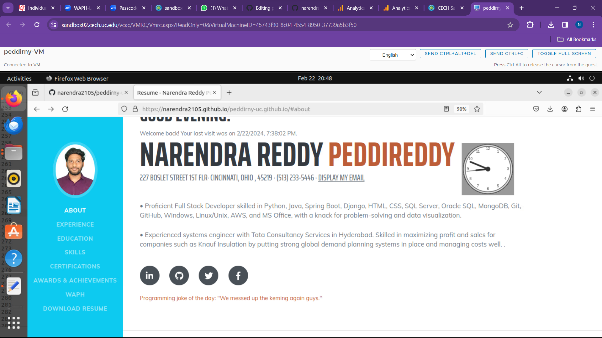
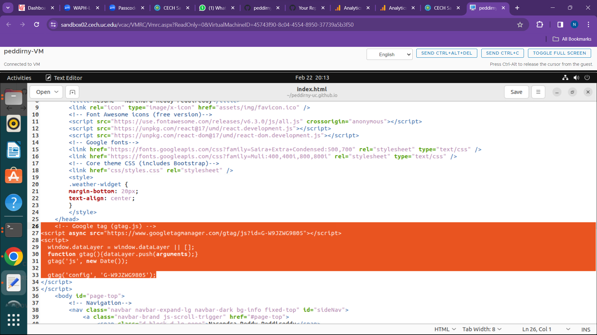

# peddirny-uc.github.io
# WAPH: WEB APPLICATION PROGRAMMING AND HACKING
# waph-peddinry
## instructor : Dr.Phu Phung
**Name**: Narendra Reddy Peddireddy
**Email**: peddirny@mail.uc.edu

Repository's URL: [https://github.com/narendra2105/waph-peddinry.git](https://github.com/narendra2105/waph-peddinry.git)

Individual project Repository's URL: [https://github.com/narendra2105/peddirny-uc.github.io](https://github.com/narendra2105/peddirny-uc.github.io)

Narendra Reddy Peddireddy uses this private repository to house all of the course's code. The following is how this repository is organized.

### Individual_Project_1

### Overview of Individual_Project_1

The goal of this project is to create a GitHub Pages-hosted professional profile website with a JavaScript, jQuery, and React.js personal portfolio. Technical requirements include using an open-source Bootstrap framework for responsive design, integrating two public online APIs, and using JavaScript cookies to display personalized greetings when a user returns. The incorporation of a Google Analytics page tracker to track site traffic and user engagement is one of the non-technical requirements.

The directory can be accessed at https://github.com/narendra2105/peddirny-uc.github.io/edit/main/README.md.

### General requirements:

i.Using a Bootstrap template that was customized and taken from github, the personal portfolio was created. It includes professional details like name, contact information, educational background, experiences, and skills, as well as a section that highlights completed labs and hackathons from the WAPH coursework.

ii.Including an introduction to the "Web Application Programming and Hacking" course, a link to a new HTML website, and associated practical projects 

First, I connected to it using a <a> element in the education part. There, beneath the description of my master's degree, is a link for "web application programming and hacking," which, when clicked, takes you to the waph.html page, as you can see in the screenshot I've attached.

### Non-Technical-Requirements

i My professional portfolio, which targets potential employers and will be assessed as part of my job application process, makes use of an open-source CSS framework such as Bootstrap.

ii page tracker

This portfolio incorporates a Google analytics page tracker to keep an eye on traffic and statistics.

### Technical_requirements

i A React.js component was created independently for the digital clock, compiled as a stand-alone JavaScript file, and added to the project along with the required React and ReactDOM libraries. On the other hand, the analog clock feature was added to the website directly, improving user experience, and was placed inside the contact section. This was accomplished by utilizing code that was identical to that used in a prior lab.

ii Integration of Web APIs

Using the weather API from weatherbit.io, I was able to incorporate weather data into the website and improve user experience by retrieving relevant information like current weather conditions and accompanying weather icons.

Like in a previous lab activity, I added a joke API to my website and at the conclusion of the page showed the joke that was retrieved, making the user experience fun and interesting.

iii JavaScript cookies

Cookies are used by websites to save session states, which enable them to customize user experiences. To improve user engagement and retention, newly registered users will have a personalized "welcome back" greeting, while new users will see a "welcome to my profile" message.

